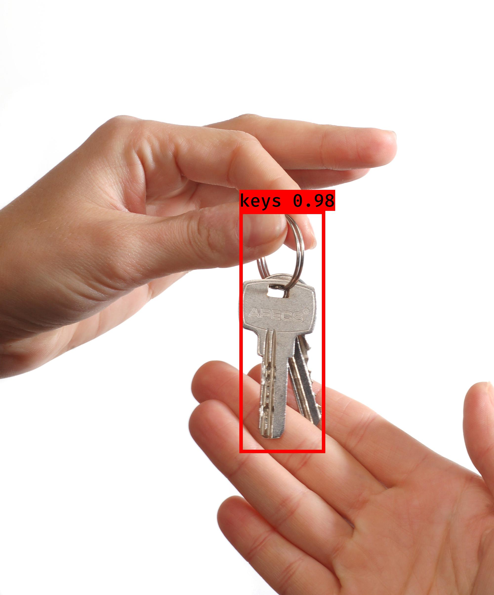

# keras-yolo3

[](LICENSE)

## Introduction

A Keras implementation of YOLOv3 (Tensorflow backend) inspired by [qqwweee/keras-yolo3](https://github.com/qqwweee/keras-yolo3).
This Work was applied on Keys datasets

<p align="center">
  
</p>


---

## Quick Start
1. Download datasets Keys without background and background images
2. Generate the new datasets (keys combined with background)
3. Download YOLOv3 weights from [YOLO website](http://pjreddie.com/darknet/yolo/).
4. Convert the Darknet YOLO model to a Keras model.
5. Run train1 and train2
6. Run YOLO detection.

```
## How it works
	#1. Download datasets :
	wget https://github.com/belarbi2733/keras_yolov3/releases/download/1/key_wb.zip
	wget https://github.com/belarbi2733/keras_yolov3/releases/download/1/bckgrnd.zip
	unzip key_wb.zip
	unzip bckgrnd.zip
	#2. Combine Keys with Backgrounds :
	python keys_with_background.py --keys "key_wb" --background "bckgrnd" --output "keys_and_background"
	mv keys_and_background/annotations.csv .
	#3. Download YOLOv3 weights :
	wget https://pjreddie.com/media/files/yolov3.weights
	#4. Convert the Darknet YOLO model to a Keras model
	python convert.py yolov3.cfg yolov3.weights model_data/yolo_weights.h5
	#5. Run train1 and train2 :
	python train1.py --initial_epoch1 0 --epoch1 5 --batch_size1 64  --annotation 'annotations.csv' --classes 'model_data/key_classes.txt' --anchors 'model_data/yolo_anchors.txt' 
	python train2.py --initial_epoch2 5 --epoch2 10 --batch_size2 64 --annotation 'annotations.csv' --classes 'model_data/key_classes.txt' --anchors 'model_data/yolo_anchors.txt' 
	#6. Run YOLO detection :
	python test_yolo.py --image --input='keys_and_background/gen_0001.jpg' --output='yolo1.jpg' --model 'weights_yolo_train/trained_weights_final.h5' --classes 'model_data/key_classes.txt' --anchors 'model_data/yolo_anchors.txt'

###Bonus test with video	
	python yolo_test.py input='video_path' output='video_saved' --video    for video detection mode 
```

For Tiny YOLOv3, just do in a similar way, just specify model path and anchor path with `--model model_file` and `--anchors anchor_file`.

### Usage
Use --help to see usage of yolo_video.py:
```
usage: test_yolo.py  [-h] [--model MODEL] [--anchors ANCHORS]
                     [--classes CLASSES] [--gpu_num GPU_NUM] [--image]
                     [--input] [--output]

positional arguments:
  --input        Video or Image input path
  --output       Video or Image output path

optional arguments:
  -h, --help         show this help message and exit
  --model MODEL      path to model weight file, default model_data/yolo.h5
  --anchors ANCHORS  path to anchor definitions, default
                     model_data/yolo_anchors.txt
  --classes CLASSES  path to class definitions, default
                     model_data/coco_classes.txt
  --image            Image detection mode, will ignore all positional arguments
```
---


## Explain the Training for other datasets

1. Generate your own annotation file and class names file.  
    One row for one image;  
    Row format: `image_file_path box1 box2 ... boxN`;  
    Box format: `x_min,y_min,x_max,y_max,class_id` (no space).  
    For VOC dataset, try `python voc_annotation.py`  
    Here is an example:
    ```
    path/to/img1.jpg 50,100,150,200,0 30,50,200,120,3
    path/to/img2.jpg 120,300,250,600,2
    ...
    ```

2. Make sure you have run `python convert.py -w yolov3.cfg yolov3.weights model_data/yolo_weights.h5`  
    The file model_data/yolo_weights.h5 is used to load pretrained weights.

3. Modify train.py and start training.  
    `python train.py`  
    Use your trained weights or checkpoint weights with command line option `--model model_file` when using yolo_video.py
    Remember to modify class path or anchor path, with `--classes class_file` and `--anchors anchor_file`.

If you want to use original pretrained weights for YOLOv3:  
    1. `wget https://pjreddie.com/media/files/darknet53.conv.74`  
    2. rename it as darknet53.weights  
    3. `python convert.py -w darknet53.cfg darknet53.weights model_data/darknet53_weights.h5`  
    4. use model_data/darknet53_weights.h5 in train.py

---

## Some issues to know

1. The test environment is
    - Python 3.5
    - Keras 2.2.0
    - tensorflow 1.9.0

2. Default anchors are used. If you use your own anchors, probably some changes are needed.

3. The inference result is not totally the same as Darknet but the difference is small.

4. The speed is slower than Darknet. Replacing PIL with opencv may help a little.

5. Always load pretrained weights and freeze layers in the first stage of training. Or try Darknet training. It's OK if there is a mismatch warning.

6. The training strategy is for reference only. Adjust it according to your dataset and your goal. And add further strategy if needed.

7. For speeding up the training process with frozen layers train_bottleneck.py can be used. It will compute the bottleneck features of the frozen model first and then only trains the last layers. This makes training on CPU possible in a reasonable time. See [this](https://blog.keras.io/building-powerful-image-classification-models-using-very-little-data.html) for more information on bottleneck features.
